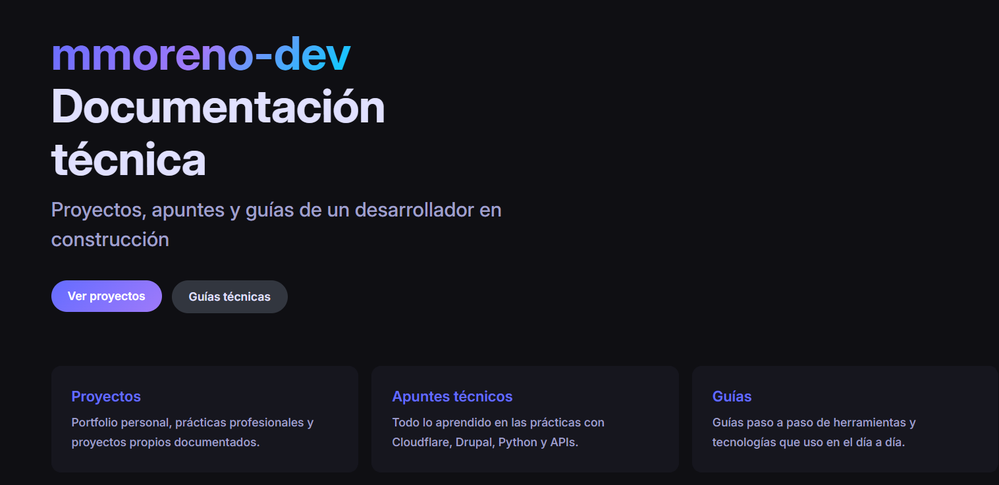
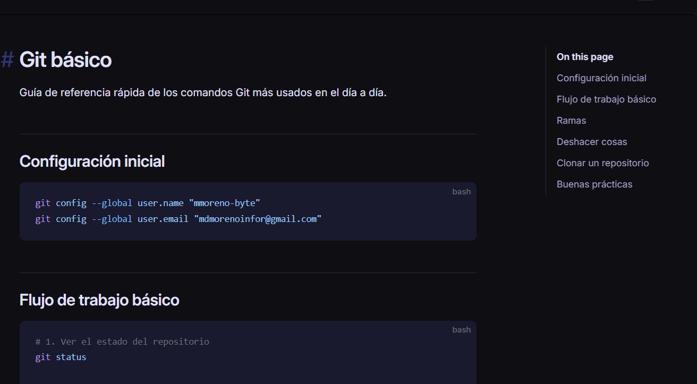

# mmoreno-dev Docs

Documentación técnica personal con proyectos, lecciones aprendidas y guías. Construida con **VitePress** y desplegada en **Cloudflare Workers**.

**URL en vivo:** https://mmoreno-docs.mdmorenoinfor.workers.dev/

## 📸 Preview

<div style="display: grid; grid-template-columns: repeat(2, 1fr); gap: 15px;">




</div>

## 📚 Contenido

- **9+ Proyectos documentados** - Videogames API, Data Dashboard, Claude Chat, DoFocus y más
- **Guías técnicas** - Git, Python, Docker, APIs REST, despliegue en Google Cloud
- **Análisis y tendencias** - GitHub Analytics, Job Board, análisis de mercado tech
- **Contenido en construcción** - Documentación que crece con cada proyecto

## 🛠️ Stack

- **VitePress** - Generador estático para documentación
- **Markdown** - Contenido en formato simple y limpio
- **Cloudflare Workers** - Hosting serverless

## 🚀 Desarrollo local

```bash
npm install
npm run docs:dev
```

## 📦 Build

```bash
npm run docs:build
```

## 👤 Autor

mmorenodev — [GitHub](https://github.com/mmoreno-byte) · [Portfolio](https://mmoreno-byte.github.io/mmorenodev/)
