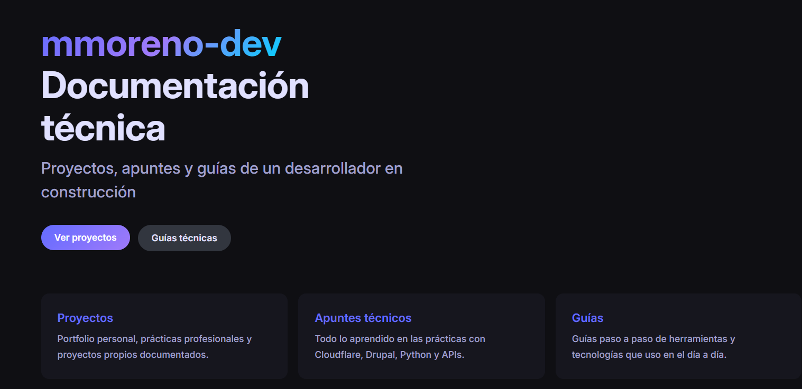
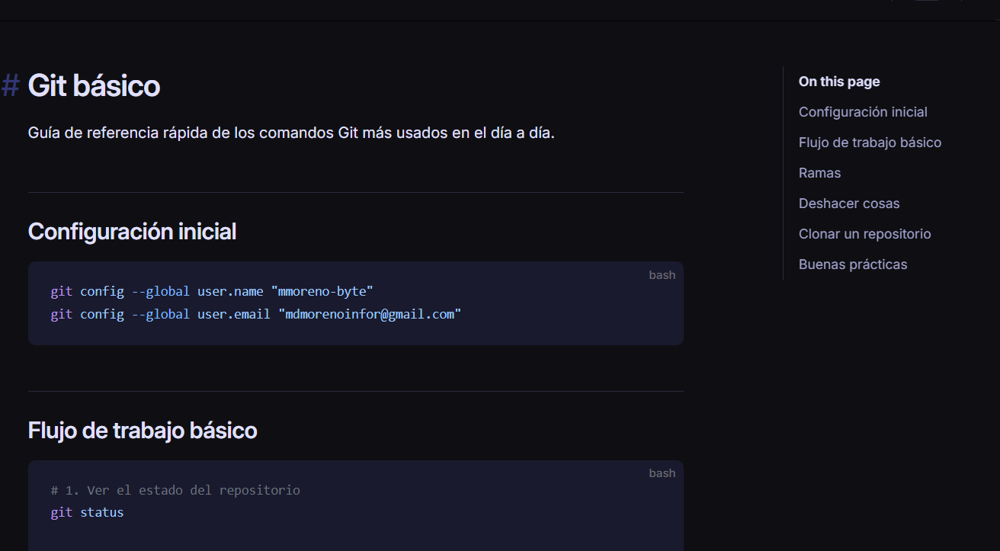

# mmoreno-dev Docs

Documentación técnica personal con proyectos, lecciones aprendidas y guías. Construida con **VitePress** y desplegada en **Cloudflare Pages**.

**Portfolio:** [https://mmoreno.dev](https://mmoreno.dev)
**Docs en vivo:** [https://mmoreno-docs.pages.dev](https://mmoreno-docs.pages.dev)

## 📸 Preview

<div style="display: grid; grid-template-columns: repeat(2, 1fr); gap: 15px;">




</div>

## 📚 Contenido

- **10+ Proyectos documentados** — RAG Document Agent, Videogames API + Frontend, Data Dashboard, Claude Chat, SAP-Turismo, MM Web Studio y más
- **Frontend** — Portfolio en React 19 + Vite, Ana Moreno Portfolio, Videogames Frontend
- **Backend / APIs** — Java/Spring Boot con JWT, Python/Flask, FastAPI + Pandas
- **SAP ABAP Cloud** — RAP con OData V4, Fiori Elements Preview, y SAP CAP como capa de extensión
- **Ciberseguridad** — Documentación y proyectos del área (portfolio en mmoreno.dev)
- **Guías técnicas** — Git, Python, Docker, APIs REST, despliegue en Google Cloud, estructura React

## 🛠️ Stack

- **VitePress** — Generador estático para documentación
- **Markdown** — Contenido en formato simple y limpio
- **Cloudflare Pages** — Hosting serverless con dominio `mmoreno.dev` (zona gestionada aquí)

## 🚀 Desarrollo local

```bash
npm install
npm run docs:dev
```

## 📦 Build

```bash
npm run docs:build
```

El output queda en `docs/.vitepress/dist/`.

## 🚢 Despliegue

El sitio se despliega automáticamente en **Cloudflare Pages** al hacer push a `main` (configurado con Wrangler).

```bash
npm run docs:build
npx wrangler pages deploy docs/.vitepress/dist
```

## 👤 Autora

**Loli Moreno (mmorenodev)** — [Portfolio](https://mmoreno.dev) · [GitHub](https://github.com/mmoreno-byte) · [LinkedIn](https://linkedin.com/in/maria-dolores-moreno-cabrera-194983151)
